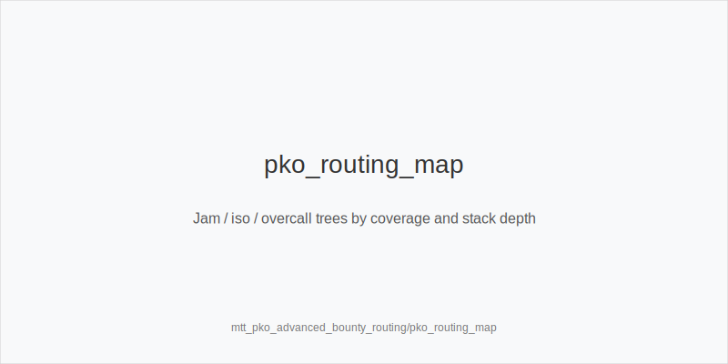
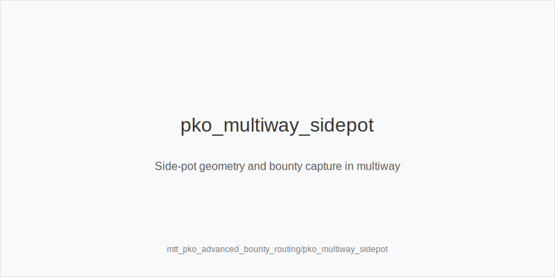
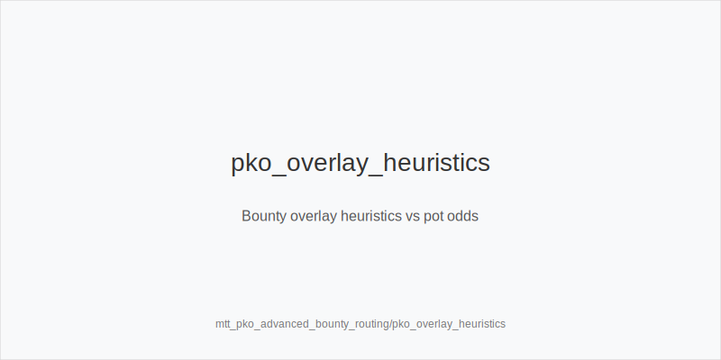

What it is
Advanced bounty routing is choosing jam, isolate-raise, overcall, or fold in PKO based on coverage, bounty sizes, and side-pot geometry. You aim to capture bounties heads-up, avoid giving others cheap shots at your target, and keep SPRs friendly to your hand class and position.

[[IMAGE: pko_routing_map | Jam / iso / overcall trees by coverage and stack depth]]

[[IMAGE: pko_multiway_sidepot | Side-pot geometry and bounty capture in multiway]]

[[IMAGE: pko_overlay_heuristics | Bounty overlay heuristics vs pot odds]]

Why it matters
Bounty equity changes price-to-play. When you cover a short with a large bounty, extra EV appears; when you are covered, your own bounty invites wider calls and punishments. Multiway dilutes your bounty capture and creates side pots where your chip EV can be fine but bounty EV suffers. Clear routing avoids these traps.

Rules of thumb
- Coverage first: widen aggressively when you cover the short bounty; tighten when you are covered and your bounty is valuable.
- Heads-up beats multiway for bounties: prefer isolate (3bet_ip_9bb / 3bet_oop_12bb proxies) over overcalls that invite a third player who may cover you.
- Side-pot heuristics: overcall only when the side pot is large and your equity edge persists multiway; otherwise isolate to lock the bounty.
- Depth bands: at 12-20bb, shove-first trees dominate; avoid flats OOP. At 20-35bb, mix iso-raise and reshove; keep 4bet_ip_21bb / 4bet_oop_24bb value-lean. At 35-60bb, favor iso when covering; still avoid dominated multiway OOP.
- Postflop as the cover: small_cbet_33 on static boards; half_pot_50 on range turns to set commit lines; big_bet_75 only with size_up_wet and coverage edge. When covered, protect_check_range more, and use delay_turn / probe_turns selectively.
- Exploits: when no bounty pull exists, pools overfold turns; tag overfold_exploit and pressure range cards.

Mini example
BTN 38bb covers SB 14bb with a large bounty. CO opens 2.3bb. SB jams 14bb. BTN overcalling risks BB back-raising and multiway dilution. BTN chooses to isolate using 3bet_ip_9bb (jam-proxy). CO folds; heads-up pot forms. BTN locks bounty capture when winning and avoids giving BB a shot. If BTN were covered by CO, the same hand often folds or flats tighter because bounty EV flips risk direction. Postflop after an iso-call: on K72r, small_cbet_33; on a 5x turn that favors BTN, half_pot_50 as double_barrel_good; river scare only with blockers (triple_barrel_scare), else check back.

Common mistakes
- Overcalling as the cover and inviting a third player who covers you; bounty EV gets diluted.
- Isolating too small, leaving room for profitable back-raises or multiway calls.
- Hero-calling when covered and your bounty is attractive; risk premium is ignored.
- Bluff 4-betting without blockers or coverage edge at 20-35bb.
- Firing big_bet_75 without size_up_wet equity or coverage; donates your bounty when raised.

Mini-glossary
Coverage: You have more chips than villain; you can win their bounty.
Overlay: Bounty value acting like added pot share in EV.
Isolate: Raise to force heads-up with the all-in bounty target.
Overcall: Call an all-in to keep others in; useful only with strong side-pot equity.
Side pot: Extra pot between non-all-in players; can overshadow bounty EV if large.

Contrast
Compared to basic PKO, advanced routing emphasizes heads-up capture, side-pot math, and depth-specific iso vs overcall choices. Compared to non-PKO, you weight coverage and bounty overlay above small chip-EV edges, especially when multiway risk looms.

_This module uses the fixed families and sizes: size_down_dry, size_up_wet; small_cbet_33, half_pot_50, big_bet_75._

See also
- cash_short_handed (score 27) -> ../../cash_short_handed/v1/theory.md
- hand_review_and_annotation_standards (score 27) -> ../../hand_review_and_annotation_standards/v1/theory.md
- mtt_day2_bagging_and_reentry_ev (score 27) -> ../../mtt_day2_bagging_and_reentry_ev/v1/theory.md
- mtt_pko_strategy (score 27) -> ../../mtt_pko_strategy/v1/theory.md
- cash_population_exploits (score 25) -> ../../cash_population_exploits/v1/theory.md