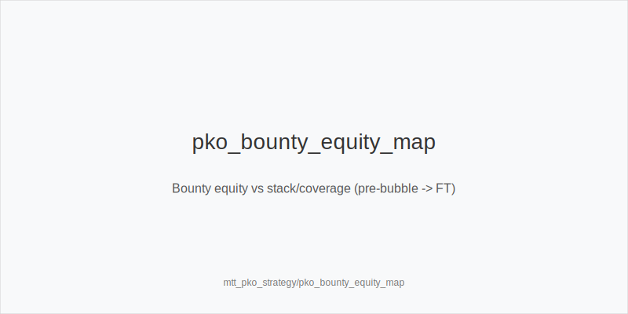
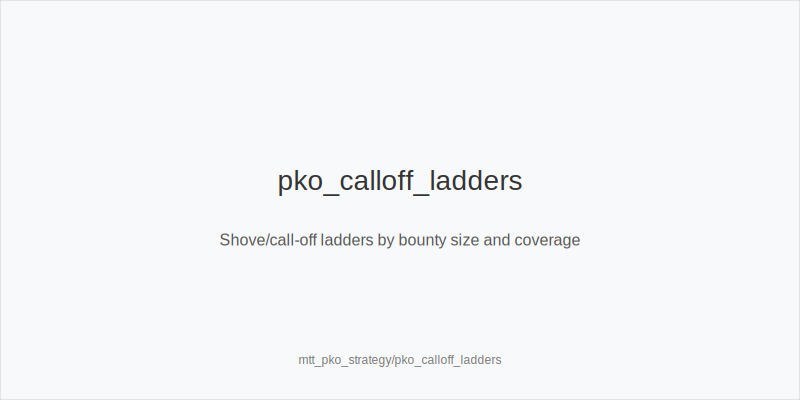
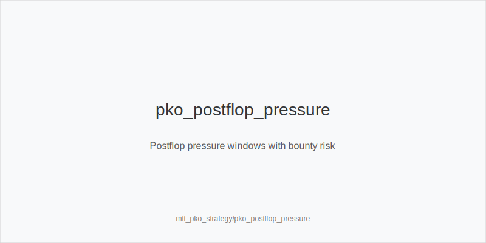

What it is
PKO strategy adapts normal MTT play to bounty equity. Each knockout pays half of the target bounty now and adds half to your own bounty. Coverage matters: you can only win a bounty if you cover the all-in stack. PKO ranges shift most in shove/call-off spots and in turn-river aggression where risk and reward depend on bounties.

[[IMAGE: pko_bounty_equity_map | Bounty equity vs stack/coverage (pre-bubble -> FT)]]

[[IMAGE: pko_calloff_ladders | Shove/call-off ladders by bounty size and coverage]]

[[IMAGE: pko_postflop_pressure | Postflop pressure windows with bounty risk]]

Why it matters
Bounty equity acts like extra pot share. When you cover a short with a big bounty, profitable calls and reshoves appear that would be folds in non-PKO. When you are covered and hold a large bounty, opponents call wider; thin bluffs and marginal peels lose value. Clear, tokenized trees reduce errors under changing incentives.

Rules of thumb
- Coverage first: widen call-offs and reshoves when you cover short big bounties; tighten when you are covered and your own bounty is large.
- Preflop trees: map jams and reshoves to 3bet_ip_9bb and 3bet_oop_12bb proxies. Keep 4bet_ip_21bb and 4bet_oop_24bb value-lean; bluff 4-bets rare unless you cover and hold top blockers plus strong bounty overlay.
- Big stacks: hunt bounties. Apply 3bet_ip_9bb and 3bet_oop_12bb pressure versus steals; isolate shorts rather than flatting multiway.
- Medium stacks: balance ladder EV and bounty EV. Avoid dominated flats OOP; prefer shove-first lines when covered.
- Short stacks: expect wider calls versus your jams when your bounty is big. Choose hands with equity and blockers; trim weak bluffs.
- Postflop: small_cbet_33 on static boards when uncapped and bounty risk is low. Use half_pot_50 on turns that set clean commit lines with value+equity; big_bet_75 only with size_up_wet and when you cover villain. OOP protect_check_range more to avoid stack-offs that donate your bounty.
- Tempo: delay_turn and probe_turns selectively. Reduce bluff rate when covered and your bounty is juicy; increase pressure as the cover on range-shifting turns with double_barrel_good and use triple_barrel_scare only with credible blockers.
- Exploit: overfold_exploit appears when no bounty is at stake (deep stacks, dry runouts) and pools fold too many turns.

Mini example
Bubble, 9-max. CO 35bb covers BTN 12bb who has a big bounty. CO opens 2.2bb; BTN jams. Because CO covers and bounty overlay is large, CO widens call-off beyond non-PKO, calling ATo/KQs/66 that might be folds otherwise. Later, CO opens and BB (covered) flats. Flop K72r: CO small_cbet_33. Turn 5x improves CO range and keeps bounty risk low; CO half_pot_50 as double_barrel_good. On river A, with blockers, CO considers triple_barrel_scare; without, check back and realize the bounty edge safely.

Common mistakes
- Ignoring coverage: calling too tight versus short covered bounties or too loose when you are the covered target.
- Flatting multiway OOP to "trap" a short bounty and creating bad SPR; shove or fold instead.
- Vanity big_bet_75 when covered and without size_up_wet equity; gives away your bounty.
- Bluff 4-betting into tight ranges without blockers or coverage advantage.
- Over-bluffing turns when your own bounty is attractive; pools snap wider there.

Mini-glossary
Coverage: you have more chips than villain; you can win their bounty.
Bounty overlay: bounty value acting like added pot share in EV.
3bet_ip_9bb / 3bet_oop_12bb: shove/reshove proxies for PKO clarity.
4bet_ip_21bb / 4bet_oop_24bb: value-lean 4-bet families under PKO.
small_cbet_33 / half_pot_50 / big_bet_75: postflop size families by texture and leverage.
protect_check_range / delay_turn / probe_turns: low-risk lines managing bounty exposure.
overfold_exploit: node where pools fold too much; press as cover.

Contrast
Compared to non-PKO, PKO widens call-offs and reshoves when you cover, tightens when covered, and shifts postflop aggression toward turns and rivers that convert bounty pressure, not just pot-share equity.

_This module uses the fixed families and sizes: size_down_dry, size_up_wet; small_cbet_33, half_pot_50, big_bet_75._

See also
- cash_short_handed (score 29) -> ../../cash_short_handed/v1/theory.md
- hand_review_and_annotation_standards (score 29) -> ../../hand_review_and_annotation_standards/v1/theory.md
- cash_population_exploits (score 27) -> ../../cash_population_exploits/v1/theory.md
- database_leakfinder_playbook (score 27) -> ../../database_leakfinder_playbook/v1/theory.md
- donk_bets_and_leads (score 27) -> ../../donk_bets_and_leads/v1/theory.md