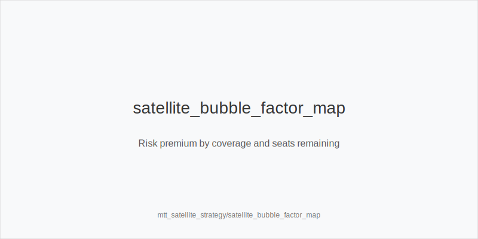
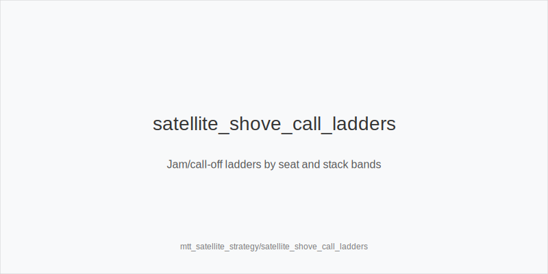
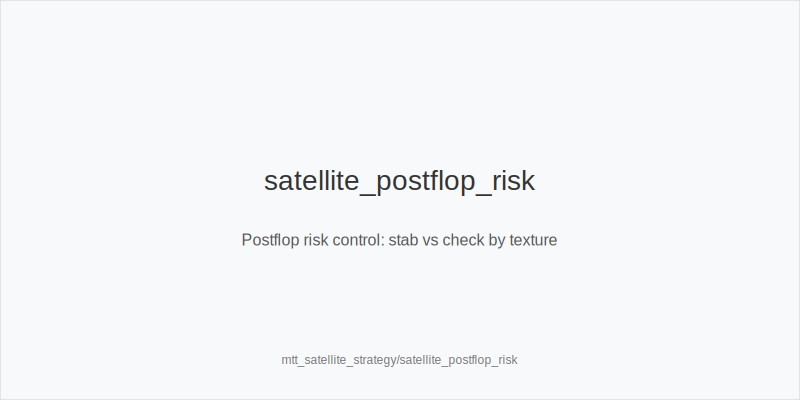

What it is
Satellite strategy for 9-max with flat tickets prioritizes survival over chip accumulation. Decisions weight bubble factor, coverage (who covers whom), and seat math (players left vs seats). Preflop trees lean jam-first; postflop lines avoid variance. You will use size families and line tokens to keep risk controlled.

[[IMAGE: satellite_bubble_factor_map | Risk premium by coverage and seats remaining]]

[[IMAGE: satellite_shove_call_ladders | Jam/call-off ladders by seat and stack bands]]

[[IMAGE: satellite_postflop_risk | Postflop risk control: stab vs check by texture]]

Why it matters
One chip won is not equal to one chip lost when seats are flat. Calling off and busting is far worse than folding a small edge. Coverage asymmetry flips incentives: when covered, your stack has higher risk premium; when you cover shorts, shoves deny equity and win seats. Avoiding multiway side pots reduces bust risk and preserves fold equity later.

Rules of thumb
- Seat math first: if players left <= seats, fold everything except hands that cannot lose chips (time down). If close to seats, treat medium stacks as highest risk premium.
- Coverage logic: when covered, tighten call-offs and flats; prefer fold or shove trees mapped to 3bet_oop_12bb / 3bet_ip_9bb. When you cover a short, widen reshoves; still avoid thin calls that can bust you.
- Stack bands: 8-15bb jam-first vs opens; avoid flats OOP. 16-25bb prefer shove/reshove or tight folds; flat IP selectively when not covered. 26-40bb open small, 3-bet narrower; 4bet_ip_21bb / 4bet_oop_24bb value-lean only.
- Multiway control: avoid dominated flats OOP; choose 3bet_oop_12bb over call to prevent side pots that risk your seat.
- Postflop defaults: small_cbet_33 on static boards when uncapped and risk low; protect_check_range OOP on middling boards; delay_turn and probe_turns only when the turn clearly favors you and bust risk is limited.
- Sizing gates: half_pot_50 only when committing with value+equity and SPR is clean; big_bet_75 only with size_up_wet and real equity (rare in satellites).
- Exploit awareness: many players overfold turns near the bubble; tag overfold_exploit and pressure only when not risking coverage disasters.

Mini example
Bubble: 10 left, 9 seats. You are CO 22bb, covered by BTN 40bb and blinds 30/18bb. HJ opens 2.2bb (20bb), you hold AJs. Flatting invites BTN squeeze and creates side pots. You choose 3bet_ip_9bb only if it functions as a shove/reshove to force folds; otherwise fold. If HJ folds and BTN opens your SB next hand with 16bb BB short behind, you defend BB tighter: fold marginals, avoid multiway. Postflop when you reach a heads-up pot on K72r as the raiser and not covered, small_cbet_33; on turn bricks, prefer delay_turn or check to avoid committing unless very strong.

Common mistakes
- Calling off while covered with medium strength because "priced in." In satellites, price is dominated by risk premium.
- Flatting OOP versus opens to "see a flop," then facing multiway side pots that risk the seat.
- Using big_bet_75 without equity on volatile turns; it bloats the pot and induces punted call-offs.
- Bluff 4-betting without coverage or blockers at 20-30bb; value only.
- Over-stabbing turns IP after flop checks when coverage is against you; better to protect_check_range.

Mini-glossary
Bubble factor: extra equity needed to risk elimination relative to chip-EV.
Coverage: who can bust whom; being covered increases your risk premium.
Seat math: players remaining vs seats; determines how tight you should be.
Side pot: chips wagered by non-all-in players; increases bust exposure.
Call-off: committing your stack versus an all-in; ultra-tight when covered.

Contrast
Unlike chips-EV MTT or PKO, satellites weight survival over chip gain. Jam-first preflop and risk-controlled postflop dominate; thin edges, splashy multiway flats, and big polar bets are mostly removed unless they clearly lock a seat.

_This module uses the fixed families and sizes: size_down_dry, size_up_wet; small_cbet_33, half_pot_50, big_bet_75._

See also
- database_leakfinder_playbook (score 25) -> ../../database_leakfinder_playbook/v1/theory.md
- donk_bets_and_leads (score 25) -> ../../donk_bets_and_leads/v1/theory.md
- hand_review_and_annotation_standards (score 25) -> ../../hand_review_and_annotation_standards/v1/theory.md
- icm_final_table_hu (score 25) -> ../../icm_final_table_hu/v1/theory.md
- live_chip_handling_and_bet_declares (score 25) -> ../../live_chip_handling_and_bet_declares/v1/theory.md