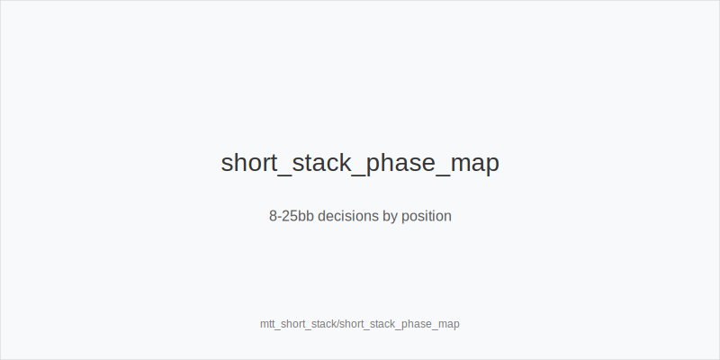
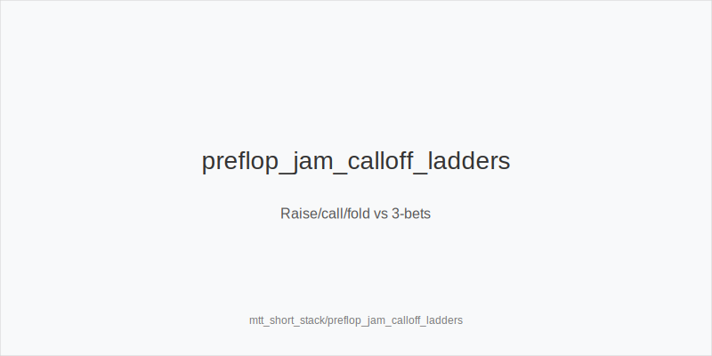
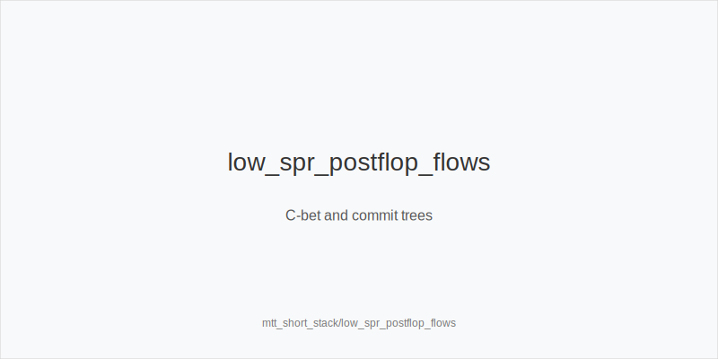

What it is
Short-stack play covers 8-25bb effective in 9-max MTTs. At 8-12bb, decisions cluster around push/fold and reshove. At 13-17bb, mixes include jam, raise-call, and raise-fold. At 18-25bb, small opens and 3-bet/4-bet trees reappear, but SPR stays low, so commitment math drives lines more than fancy maneuvering.

[[IMAGE: short_stack_phase_map | 8-25bb decisions by position]]

[[IMAGE: preflop_jam_calloff_ladders | Raise/call/fold vs 3-bets]]

[[IMAGE: low_spr_postflop_flows | C-bet and commit trees]]

Why it matters
Antes inflate pots and shorten SPR. Small mistakes compound fast when you are close to all-in. A clean, tokenized plan avoids spew: map preflop to simple shove/reshove families and keep postflop sizes tied to equity and geometry. Pools under-4bet and overfold turns; exploit while staying value heavy.

Rules of thumb
- Preflop families: treat 3bet_ip_9bb and 3bet_oop_12bb as shove/reshove proxies at 8-17bb; use 4bet_ip_21bb and 4bet_oop_24bb as all-in 4-bet proxies. Why: low SPR and antes favor decisive all-in trees.
- Seat by stack: 8-12bb jam or reshove with blockers and avoid flats OOP; 13-17bb raise-call premiums and raise-fold suited wheels; 18-25bb reopen small opens and prefer 3bet_oop_12bb over flats from blinds. Why: position and realization change quickly by stack depth.
- Open sizes: keep opens small; when dominated multiway risk is high, prefer fold or 3bet_oop_12bb over flatting trash. Why: you avoid bad SPRs and dominated calls.
- Postflop at low SPR: small_cbet_33 on dry to deny cheaply; half_pot_50 when planning to commit; big_bet_75 only with size_up_wet and strong equity. As OOP, protect_check_range on middling, avoid thin stabs. Why: sizes must match equity and commitment math.
- Exploits: tag overfold_exploit on turns where population gives up; do not bluff-catch without blockers at shallow SPR. Why: pools fold too much and stacks are short.

Mini example
UTG and MP fold; CO opens 2.2bb; BTN 3bet_ip_9bb to 9bb; SB reshoves 15bb; BB folds. CO folds; action returns to BTN. With QQ/AK, BTN treats 4bet_ip_21bb as a call-off and commits; with AJs/KQs he releases versus the reshove. Result: clean preflop commitment at low SPR without awkward postflop guessing.

Common mistakes
- Flatting 10-15bb OOP versus late opens, then folding flop. Why it is a mistake: you donate antes and realize poorly. Why it happens: fear of jamming light and anchoring to deeper-stack habits.
- Auto big_bet_75 at low SPR without equity. Why it is a mistake: you polarize, get raised, and cannot fold. Why it happens: copying deep-stack lines where fold equity is higher.
- Bluff 4-betting without blockers at 15-20bb. Why it is a mistake: ranges are strong and you torch EV. Why it happens: overestimating fold equity versus tight 3-bettors.

Mini-glossary
Shove/reshove proxy: Using 3bet_ip_9bb or 3bet_oop_12bb as shorthand for jam/reshove trees.
Commitment math: Plan lines that commit by turn when price and SPR align.
SPR: Stack-to-pot ratio; low values compress play and favor all-in decisions.
overfold_exploit: Intentional pressure where pools fold too much, often on turns.

Contrast
Unlike deep-stacked cash, short-stack MTT play compresses ranges and forces commitment earlier. You map preflop to shove/reshove families, default to small_cbet_33 on dry, and reserve big_bet_75 for size_up_wet with real equity; most thin lines vanish at low SPR.

_This module uses the fixed families and sizes: size_down_dry, size_up_wet; small_cbet_33, half_pot_50, big_bet_75._

See also
- cash_short_handed (score 27) -> ../../cash_short_handed/v1/theory.md
- database_leakfinder_playbook (score 27) -> ../../database_leakfinder_playbook/v1/theory.md
- donk_bets_and_leads (score 27) -> ../../donk_bets_and_leads/v1/theory.md
- icm_final_table_hu (score 27) -> ../../icm_final_table_hu/v1/theory.md
- live_chip_handling_and_bet_declares (score 27) -> ../../live_chip_handling_and_bet_declares/v1/theory.md