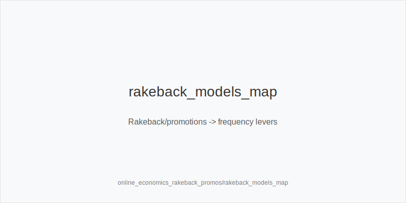
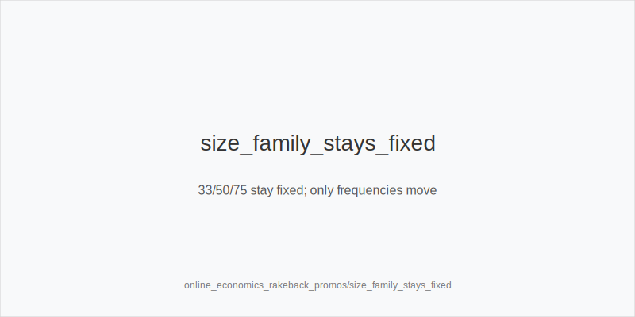

What it is
This module converts site economics-rakeback systems, promos, leaderboards, missions, milestone bonuses-into **frequency shifts** using a fixed token set: 3bet_ip_9bb, 3bet_oop_12bb, 4bet_ip_21bb, 4bet_oop_24bb, small_cbet_33, half_pot_50, big_bet_75, size_up_wet, size_down_dry, protect_check_range, delay_turn, probe_turns, double_barrel_good, triple_barrel_scare, call, fold, overfold_exploit. Trees and sizes never change; texture still selects the family: size_down_dry on static (A83r, K72r), size_up_wet on dynamic (JT9ss, 986ss).

Why it matters
Economics can move EV/hour more than small in-hand edges. Rakeback tied to volume, time‑limited missions, and leaderboard races reward **stable, low‑error** lines. We keep ladders (9/12/21/24) and 33/50/75 families fixed and shift **frequencies**, not sizes.

Rules of thumb

* Rakeback driven by volume → safer defaults when multitabling: more small_cbet_33, half_pot_50, delay_turn, protect_check_range; fewer thin triple_barrel_scare. Why: lower error rate beats marginal edge.
* Time‑limited promos/missions → prioritize soft tables and clear start/stop rules; widen 3bet_oop_12bb and 3bet_ip_9bb vs fast‑folding blinds; tag overfold_exploit only after persistent evidence. Why: immediate folds compound volume.
* Leaderboards (race EV) → standardize lines; avoid off‑tree; add probe_turns after check‑check; fold more vs big_bet_75 without blockers. Why: reduce punt risk under pace.
* Cashback thresholds → do not force high‑variance bluffs; choose size_down_dry for thin value and half_pot_50 for merged value. Why: steadier winrate around targets.
* Promo‑heavy soft windows → thinner half_pot_50 value and wider blocker 3‑bets; sizes unchanged. Why: callers are wider and preflop folds rise.
* Tough reg windows despite promos → fold more to polar big_bet_75 without blockers; maintain protect_check_range. Why: under‑bluffed rivers and stabby turns.
* Missions that push VPIP → physics first; adjust only frequencies of in‑family bets, not sizes. Why: consistency under pressure.
* Bankroll/risk → promos do not justify off‑tree lines; ladders 9/12/21/24 stay fixed; use delay_turn when load spikes. Why: avoid variance tax.

[[IMAGE: rakeback_models_map | Rakeback/promotions -> frequency levers]]

[[IMAGE: leaderboard_grind_tradeoffs | Volume vs EV/hour trade-offs]]

[[IMAGE: size_family_stays_fixed | 33/50/75 stay fixed; only frequencies move]]

Mini example
HU 100bb during a leaderboard hour. Blinds fast‑fold often, so BB widens 3bet_oop_12bb with blockers (overfold_exploit after repeated evidence). In a 3‑bet pot on A83r, stick to size_down_dry with small_cbet_33 for clean realization. Later, an SRP checks through on T86r; the 9s turn arrives in a promo‑soft pool, so IP fires probe_turns, then on dynamic turns continues double_barrel_good with half_pot_50 by default and upgrades to big_bet_75 only with blockers and a proven fold‑vs‑75 spike. Facing a polar big_bet_75 on a scare river without blockers, fold. Sizes and ladders never change; only frequency shifts.

Common mistakes

* Chasing leaderboards with off‑tree sizes. Fix: stay within 33/50/75.
* Over‑bluffing to hit mission volume. Fix: prefer half_pot_50 merged and size_down_dry thin value.
* Ignoring texture under promo pressure. Fix: physics first, then frequency.
* Hero‑calling polar rivers without blockers. Fix: fold.
* Over‑tagging overfold_exploit on thin evidence. Fix: require persistence.

Mini-glossary
Rakeback: return of paid rake; often volume‑linked.
Leaderboard EV: value from race payouts per hour played.
Mission: time‑limited tasks affecting play volume or formats.
Promo window: period with softer pools due to incentives.
overfold_exploit tag: label for widening pressure after persistent folds.
Merged vs polar: half_pot_50 for value vs wide calls; big_bet_75 for nuts/air.

Contrast
rake_and_ante_economics covers structural fees and dead money; this module focuses on site incentives and how they shift **frequencies** while sizes and ladders stay fixed.

See also
- icm_final_table_hu (score 33) → ../../icm_final_table_hu/v1/theory.md
- live_session_log_and_review (score 33) → ../../live_session_log_and_review/v1/theory.md
- online_hudless_strategy_and_note_coding (score 33) → ../../online_hudless_strategy_and_note_coding/v1/theory.md
- online_tells_and_dynamics (score 33) → ../../online_tells_and_dynamics/v1/theory.md
- spr_advanced (score 33) → ../../spr_advanced/v1/theory.md