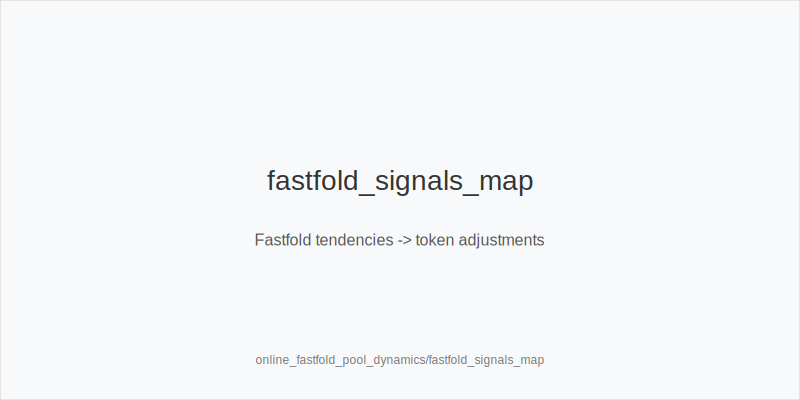
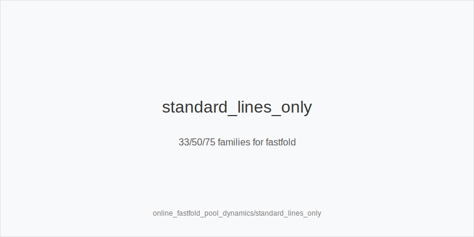

What it is
Fastfold pools (Zoom/FastForward/Rush) rotate seats each hand and often hide identities. Reads are weaker, volume is higher, and the population trends are distinct. This module maps those dynamics to our fixed action set only: 3bet_ip_9bb, 3bet_oop_12bb, 4bet_ip_21bb, 4bet_oop_24bb, small_cbet_33, half_pot_50, big_bet_75, size_up_wet, size_down_dry, protect_check_range, delay_turn, probe_turns, double_barrel_good, triple_barrel_scare, call, fold, overfold_exploit. HU-first, transferable to 6-max BvB.

Why it matters
Reduced information and higher hand volume reward simple, robust frequencies. Pool tendencies tilt toward faster preflop folding, under-4-betting, fewer turn/river bluffs, tighter calling, and more surrender after chk-chk. You keep size families (33/50/75) and preflop ladders fixed, then shift how often you use each token.

Rules of thumb

* Preflop: wider opens are fine, but prefer value-heavy 3bet_oop_12bb vs SB 2.0bb. Why: fastfold blinds overfold and under-4-bet.
* IP pressure: when repeated fast-folds appear, widen 3bet_ip_9bb with blockers; tag overfold_exploit only after persistent evidence. Why: immediate folds raise EV.
* Under-4-bet fields: add thin value to 3-bets; with premiums use 4bet_ip_21bb / 4bet_oop_24bb. Fold more marginal continues OOP. Why: low 4-bet rates.
* Flop on static boards: standardize to small_cbet_33 with size_down_dry; protect_check_range in stabby pools. Why: safe denial and fewer tough raises.
* Turn after chk-chk: many surrender; use probe_turns. Why: sequence-driven fold equity.
* Turn on dynamic cards: double_barrel_good; default half_pot_50, upgrade to big_bet_75 only with blockers + fold trend (size_up_wet). Why: leverage plus card support.
* River: under-bluffed polar nodes; default fold vs big_bet_75 without blockers. Thin value targets merged ranges with half_pot_50. Why: discipline beats guesswork.
* Load discipline: more tables -> bias to small_cbet_33, half_pot_50, delay_turn, protect_check_range; keep ladders. Why: lower APM cost.
* Notes/HUD devalue: prefer population priors; require repetition before overfold_exploit. Why: anonymity reduces sample quality.

[[IMAGE: fastfold_signals_map | Fastfold tendencies -> token adjustments]]

[[IMAGE: standard_lines_only | 33/50/75 families for fastfold]]

Mini example
Repeated blind fast-folds. BB widens 3bet_oop_12bb with A5s and tags overfold_exploit. In the 3-bet pot on A83r, pot ~18bb, choose small_cbet_33 (size_down_dry). Later an SRP checks through; on a favorable turn, fire probe_turns. River A94r-6s-Kd: facing big_bet_75 without blockers, fold.

Common mistakes

* Overfitting single datapoints in anonymous pools. Fix: wait for repetition before overfold_exploit.
* Inventing off-tree sizes. Fix: stay with small_cbet_33, half_pot_50, big_bet_75.
* Hero-calling polar river bets. Fix: fold without blockers.
* Skipping protect_check_range and getting farmed by probes. Fix: protect key checks.
* Forcing big_bet_75 on dry boards. Fix: prefer size_down_dry unless dynamic + blockers.

Mini-glossary
Fastfold: format with rapid seat rotation; weaker reads, higher volume.
Under-4-bet: population 4-bets less than theory; value 3-bets and 4-bets gain.
Surrender after chk-chk: high fold rate to turn stabs; triggers probe_turns.
Merged vs polar: half_pot_50 aims at calls; big_bet_75 represents polar pressure.
Blockers: cards that remove value/miss combos; required for big_bet_75 bluffs.
Population prior: default pool tendency used when notes/HUD are thin.

Contrast
Regular tables allow deeper reads and opponent-specific exploits. Fastfold reduces information, so sizes stay identical and only frequencies move within the same token set.

See also
- icm_mid_ladder_decisions (score 29) -> ../../icm_mid_ladder_decisions/v1/theory.md
- live_etiquette_and_procedures (score 29) -> ../../live_etiquette_and_procedures/v1/theory.md
- live_full_ring_adjustments (score 29) -> ../../live_full_ring_adjustments/v1/theory.md
- live_tells_and_dynamics (score 29) -> ../../live_tells_and_dynamics/v1/theory.md
- online_hud_and_db_review (score 29) -> ../../online_hud_and_db_review/v1/theory.md