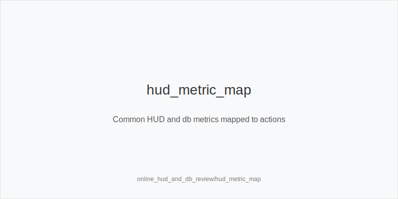
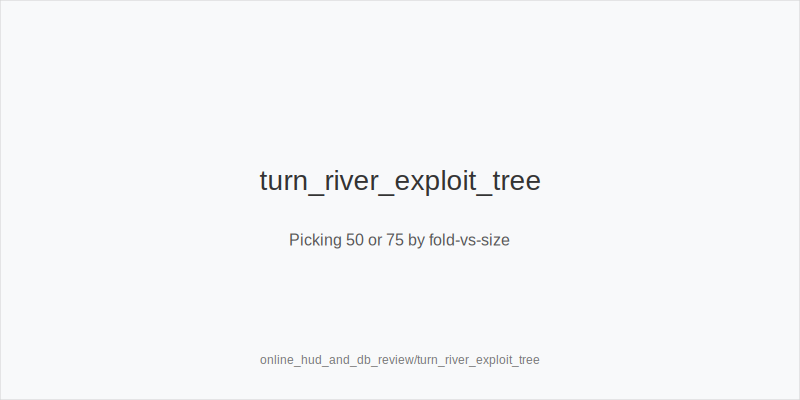
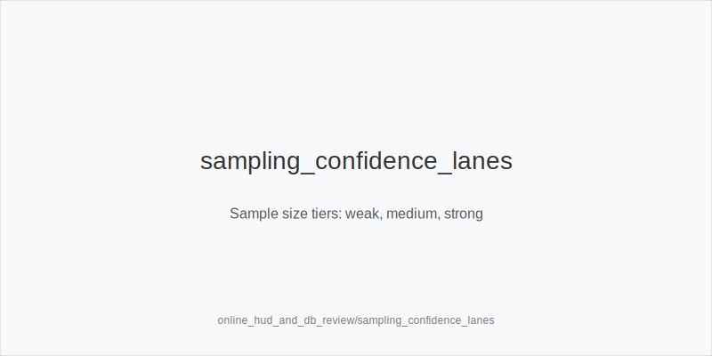

What it is
What it is
This module shows how to turn HUD and database stats into frequency shifts using the fixed action set only: 3bet_ip_9bb, 3bet_oop_12bb, 4bet_ip_21bb, 4bet_oop_24bb, small_cbet_33, half_pot_50, big_bet_75, size_up_wet, size_down_dry, protect_check_range, delay_turn, probe_turns, double_barrel_good, triple_barrel_scare, call, fold, overfold_exploit. Heads-Up first, transferable to 6-max. We keep size families 33/50/75 and adjust how often we use them.

[[IMAGE: hud_metric_map | Common HUD and db metrics mapped to actions]]

[[IMAGE: turn_river_exploit_tree | Picking 50 or 75 by fold-vs-size]]

[[IMAGE: sampling_confidence_lanes | Sample size tiers: weak, medium, strong]]

Why it matters
Stats compress thousands of hands into stable reads. The biggest EV gains come from preflop 3-bet/4-bet exploits and from turn/river fold-to-size adjustments. We do not invent new sizes; we change the mix between small_cbet_33, half_pot_50, big_bet_75 and the preflop ladders. Sampling discipline prevents false exploits.

Rules of thumb
- Fold vs 3-bet high (IP or OOP): >=57% over strong sample -> widen 3bet_oop_12bb / 3bet_ip_9bb with blockers; tag overfold_exploit. Why: more immediate folds at great price.
- 4-bet low: <=3% over strong sample -> add thin value to 3bet_oop_12bb and prefer 4bet_ip_21bb with premiums. Why: fewer 4-bets, more dominated calls.
- Fold vs Turn big bet high on dynamic cards: >=50% to 70-80% sizing -> double_barrel_good with big_bet_75 when size_up_wet fits. Why: leverage + protection vs volatile equity.
- River big under-bluffed / high fold vs river big: low River AFq + >=45% fold to large -> triple_barrel_scare with key blockers; otherwise fold more without them. Why: polar nodes reward discipline.
- Low flop c-bet + high Fold vs Probe: c-bet <=40% and fold vs probe >=50% -> probe_turns after chk-chk. Why: many opponents surrender turn.
- Flop x/r low: <=6% on static boards -> increase small_cbet_33 via size_down_dry. Why: safe range-bet environment.
- Outcome trio (WWSF / WTSD / WSD): stationy (WTSD high, WSD low) -> value with half_pot_50 and cut pure bluffs; nitty (high fold nodes) -> overfold_exploit. Why: calling discipline shows here.
- RFI wide + BB defend tight: wide opens + low BB defend -> expand 3bet_oop_12bb; vs sticky BB bias toward value. Why: preflop leakage drives EV/hour.
- Aggression by street: high Turn AFq but low River AFq -> delay_turn more with medium strength and call rivers thinner vs small; avoid triple_barrel_scare without blockers. Why: aggression collapses by river.

Sampling guidance
- Weak read: <300 hands or <100 opportunities on the stat; treat as hint only.
- Medium: 300-1k hands and >=150 opportunities; apply small shifts, seek stat convergence.
- Strong: >1k hands and >=300 opportunities on the exact node (e.g., fold vs turn 70-100%); safe to tag overfold_exploit when 2+ stats agree.
- Position/texture aware: prefer position-filtered and size-filtered splits (IP/OOP, 50 vs 75, dry vs wet) before acting.

Mini example
Profile (2k hands): Fold vs 3bet 62, 4bet 2.5, Fold vs Turn 75 on wet turns 58, River AFq 18, Flop x/r 5, Fold vs Probe 57. 
Preflop: widen 3bet_oop_12bb with A5s and tag overfold_exploit; IP value 4bet AKo at 4bet_ip_21bb. 
SRP A83r, pot ~6bb: small_cbet_33 by size_down_dry due to low x/r. 
Turn JT9ss -> 8c after your flop bet gets called: double_barrel_good with big_bet_75 by size_up_wet. 
On A94r-6s-Kd rivers, fold to big_bet_75 without blockers; versus stations, value half_pot_50; versus small merged bets, call more with bluff-catchers.

Common mistakes
- Overfitting tiny samples: require >=300-1k hands and multi-stat agreement before overfold_exploit.
- Inventing off-tree sizes: stay with small_cbet_33, half_pot_50, big_bet_75; shift only frequency.
- Ignoring texture: stats shift mixes, not physics-size_down_dry on static, size_up_wet on dynamic.
- Reading frequency without EV: pick the highest-EV token even if its frequency heatmap is lower.

Mini-glossary
VPIP/PFR: voluntary in / preflop raise; frames RFI leaks. 
Fold vs 3bet: defense vs re-raise; drives 3bet_oop_12bb / 3bet_ip_9bb and overfold_exploit. 
4bet: re-raise to four bets; under-4-betting boosts 4bet_ip_21bb and thin value 3-bets. 
Cbet: continuation bet; pair with small_cbet_33 or half_pot_50 by texture. 
Fold vs Probe: turn surrender after flop checks; triggers probe_turns. 
x/r: check-raise; low rate invites small_cbet_33 on static flops. 
AFq, WTSD, WSD, WWSF: aggression and showdown tendencies guiding fold/call/value frequency.

Contrast
Online tells use timing; this module uses aggregates. Both keep the same tokens and change only how often we deploy them.

See also
- live_etiquette_and_procedures (score 33) -> ../../live_etiquette_and_procedures/v1/theory.md
- live_full_ring_adjustments (score 33) -> ../../live_full_ring_adjustments/v1/theory.md
- live_speech_timing_basics (score 33) -> ../../live_speech_timing_basics/v1/theory.md
- online_table_selection_and_multitabling (score 33) -> ../../online_table_selection_and_multitabling/v1/theory.md
- cash_short_handed (score 31) -> ../../cash_short_handed/v1/theory.md