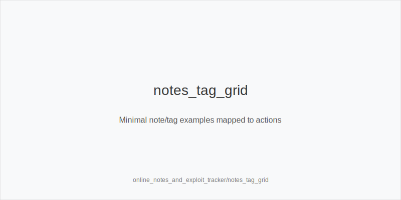
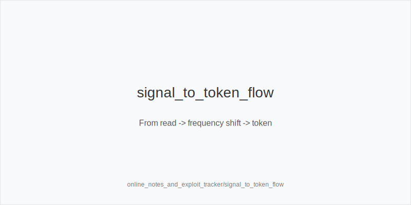
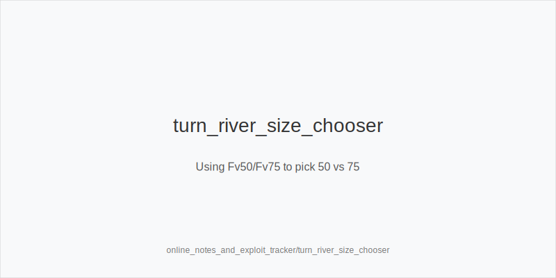

What it is
This module teaches a compact note and tag system for online play, then turns those signals into frequency shifts using only our fixed actions: 3bet_ip_9bb, 3bet_oop_12bb, 4bet_ip_21bb, 4bet_oop_24bb, small_cbet_33, half_pot_50, big_bet_75, size_up_wet, size_down_dry, protect_check_range, delay_turn, probe_turns, double_barrel_good, triple_barrel_scare, call, fold, overfold_exploit. Examples: "snap c-bet 33", "folds to 12bb 3-bets", "turn overfold to big". We never change trees or sizes; we change how often we fire each token.

[[IMAGE: notes_tag_grid | Minimal note/tag examples mapped to actions]]

[[IMAGE: signal_to_token_flow | From read -> frequency shift -> token]]

[[IMAGE: turn_river_size_chooser | Using Fv50/Fv75 to pick 50 vs 75]]

Why it matters
Good notes compress noisy hands into stable, repeatable adjustments and raise EV/hour. They keep decisions consistent under load and across formats. A clean tracker avoids guesswork and maps every read to the same size families (33/50/75) and preflop ladders.

Rules of thumb

* Fast-fold blinds or under-4-betting -> widen preflop aggression -> 3bet_oop_12bb or 3bet_ip_9bb with blockers; 4bet_ip_21bb more with premiums; tag overfold_exploit. Why: immediate folds and fewer 4-bets raise EV.
* Static flops with low x/r -> high-frequency small range bet -> small_cbet_33 with size_down_dry. Why: safe environment to realize equity and deny cheaply.
* Dynamic turns where folds spike to larger bets -> apply pressure -> double_barrel_good with big_bet_75 and size_up_wet. Why: larger size moves folds and taxes draws.
* Flop chk-chk plus high fold vs probe -> take initiative -> probe_turns. Why: opponents surrender turn too often.
* Under-bluffed polar rivers -> discipline -> fold more without blockers; with scare-card blockers consider triple_barrel_scare. Why: population lacks bluffs at big sizes.
* Versus stabby lines -> protect and pace -> protect_check_range and delay_turn with medium strength. Why: stop auto-profit stabs and keep SPR manageable.
* Wide RFI with tight BB defend -> expand preflop pressure -> 3bet_oop_12bb. Why: steal back blinds and isolate recs.
* Stationy merges (WTSD high, WSD low) -> value more, bluff less -> half_pot_50 on many rivers; thin value on static -> size_down_dry. Why: merged calls pay.

Note taxonomy and tagging

* PF: Fv3B up / 4B down -> widen 3bet_oop_12bb or 3bet_ip_9bb; value 4bet_ip_21bb.
* FL: x/r low -> small_cbet_33 (size_down_dry).
* TR: Fv75 up -> big_bet_75 as double_barrel_good (size_up_wet).
* TR: FvProbe up -> probe_turns.
* RV: Polar low -> fold more; Polar high but scare overfolds with blockers -> triple_barrel_scare.
* Seq: chk-chk a lot -> probe_turns; Stabby vs checks -> protect_check_range, delay_turn.

Workflow

* After each hand, write one short tag (signal only), not a story.
* Map tag to 1-2 tokens and note which textures apply.
* Require repetition before exploits: weak read (1-2 events), medium (3-5), strong (6+). Bias small at weak tier.
* Cross-check tags; act when multiple signals agree (e.g., Fv3B up + 4B down).
* Expire stale notes after sessions or when counters appear.
* Keep sizes fixed; shift frequencies only.

Mini example
HU 100bb. You tag SB "Fv3B up, 4B down". Next orbit, SB opens 2.0bb; you widen 3bet_oop_12bb with A5s and tag overfold_exploit. Later SRP A83r, your tag "x/r low" maps to small_cbet_33 (size_down_dry). Turn 8c on JT9ss lines, your tag "Fv75 up" maps to big_bet_75 as double_barrel_good (size_up_wet). River A94r-6s-Kd versus big_bet_75, your "Polar low" tag maps to fold without blockers.

Common mistakes

* Overfitting single datapoints; require repetition or multi-tag convergence before overfold_exploit.
* Inventing off-tree sizes; keep small_cbet_33, half_pot_50, big_bet_75 only.
* Forgetting texture; reads change frequency, not physics (size_down_dry on static, size_up_wet on dynamic).
* Never protecting checks; without protect_check_range, probe-heavy pools farm you.

Mini-glossary
Snap: instant action suggesting pre-decided range; often autopilot.
Tank-then-small: delay then small bet; commonly merged, medium strength.
Fv3B: fold vs 3-bet; high values invite 3bet_oop_12bb / 3bet_ip_9bb and overfold_exploit.
x/r: check-raise; low rate supports small_cbet_33 on static flops.
FvProbe: fold vs probe_turns after flop checks; high invites probe_turns.
Polar / Merged: big_bet_75 polar vs half_pot_50 merged.
Blockers: cards that remove value or bluffs; needed for triple_barrel_scare or thin calls.
Exploit tracker: your running tag list mapping signals to tokens.

Contrast
Online tells and HUD/DB review pull signals differently; this module is your lightweight personal tracker that converts recurring notes into the same tokens and sizes with no tree changes.

See also
- database_leakfinder_playbook (score 29) → ../../database_leakfinder_playbook/v1/theory.md
- exploit_advanced (score 29) → ../../exploit_advanced/v1/theory.md
- icm_final_table_hu (score 29) → ../../icm_final_table_hu/v1/theory.md
- live_etiquette_and_procedures (score 29) → ../../live_etiquette_and_procedures/v1/theory.md
- live_full_ring_adjustments (score 29) → ../../live_full_ring_adjustments/v1/theory.md