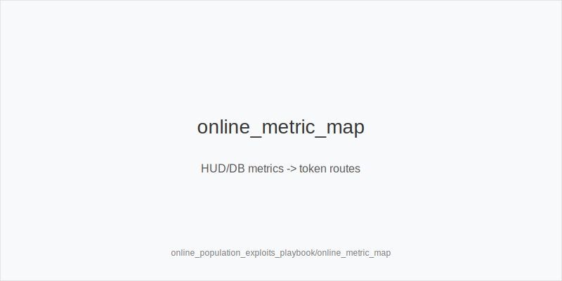
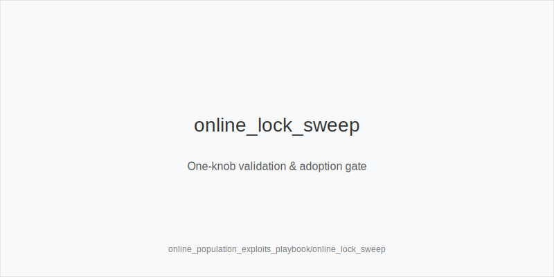
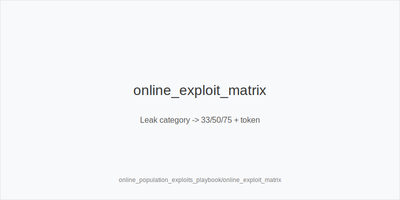

What it is
A playbook that converts common online pool tendencies into tokenized frequency shifts using the fixed actions you already know. Preflop ladders stay 3bet_ip_9bb, 3bet_oop_12bb, 4bet_ip_21bb, 4bet_oop_24bb. Postflop families are size_down_dry and size_up_wet with sizes small_cbet_33, half_pot_50, and big_bet_75 only. Each decision resolves to one token: protect_check_range, delay_turn, probe_turns, double_barrel_good, triple_barrel_scare, call, fold, or overfold_exploit. No new sizes or trees.

Why it matters
Online pools show stable biases: high Fold vs 3-bets, low 4-bets, inflated Fold vs Probe, spikes in Turn Fv75 on scare cards, and under-bluffed polar rivers. You turn those metrics into disciplined shifts: widen blocker 3-bets, adopt probe_turns after chk-chk, upgrade to big_bet_75 only with blockers and evidence, and fold more rivers without blockers. Evidence gates protect you from chasing noise.

Rules of thumb
- Preflop exploits: Fv3Bet high + 4Bet low -> widen 3bet_ip_9bb or 3bet_oop_12bb with blockers; low 5-bets -> value 4bet_ip_21bb or 4bet_oop_24bb; tag overfold_exploit only after repetition. Why: multi-stat agreement beats anecdotes.
- Family and size: static + low x/r -> size_down_dry -> small_cbet_33; dynamic -> size_up_wet -> half_pot_50; upgrade to big_bet_75 only with strong blockers and Turn Fv75 up. Why: pressure must match physics and data.
- Sequence: Fold vs Probe high after chk-chk -> probe_turns on favorable turns; never probe after bet/call. Why: initiative is earned by the skip.
- Raise-risk control: AFq turn up or x/r turn up -> delay_turn; on stabby textures mix protect_check_range. Why: avoid raise wars and keep equity realization.
- River discipline: under-bluffed polar rivers -> fold vs big_bet_75 without blockers; with scare + top blockers and a plan -> triple_barrel_scare as PFA or call. Why: blockers filter real bluffs.

Mini example
- UTG folds, MP folds, CO opens 2.5bb, BTN folds; BB reads Fv3Bet high + 4Bet low -> 3bet_oop_12bb; flop A83r -> small_cbet_33; turn AFq up -> delay_turn.
- BTN vs BB SRP on T98ss -> half_pot_50; turn Qs with nut spade blocker and Turn Fv75 up -> big_bet_75 for double_barrel_good; river K scare with plan -> triple_barrel_scare.
- SB opens, BB defends; flop chk-chk and DB shows high Fold vs Probe -> probe_turns; river pool under-bluffs big_bet_75 without blockers -> fold.

Common mistakes
- Upgrading to big_bet_75 without blockers or Turn Fv75 evidence; result: spew into sticky ranges because the pool is not folding enough.
- Probing without the chk-chk sequence; result: stabs into uncapped ranges that raise more often online.
- Tagging overfold_exploit after one orbit; result: frequency bloat based on noise, not signal.

Mini-glossary
Fv3Bet: fold vs 3-bet; high values justify blocker 3-bets or overfold_exploit after repetition.
Turn Fv75: fold vs 75% on turn; upgrades to big_bet_75 require this plus blockers.
Fold vs Probe: fold rate after flop chk-chk facing a probe; drives probe_turns.
Lock sweep: one-knob test of a metric before adopting an exploit frequency.

Contrast
Unlike database_leakfinder_playbook, this module prescribes direct token choices from HUD/DB metrics while sizes stay 33/50/75 and families remain size_down_dry vs size_up_wet.

[[IMAGE: online_metric_map | HUD/DB metrics -> token routes]]

[[IMAGE: online_lock_sweep | One-knob validation & adoption gate]]

[[IMAGE: online_exploit_matrix | Leak category -> 33/50/75 + token]]

See also
- hand_review_and_annotation_standards (score 31) → ../../hand_review_and_annotation_standards/v1/theory.md
- live_etiquette_and_procedures (score 31) → ../../live_etiquette_and_procedures/v1/theory.md
- live_full_ring_adjustments (score 31) → ../../live_full_ring_adjustments/v1/theory.md
- live_speech_timing_basics (score 31) → ../../live_speech_timing_basics/v1/theory.md
- online_hud_and_db_review (score 31) → ../../online_hud_and_db_review/v1/theory.md