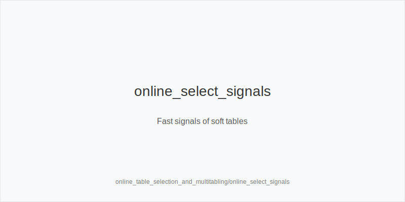
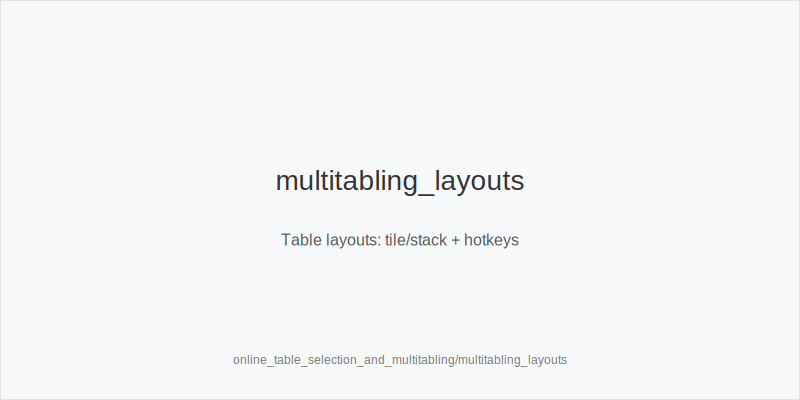
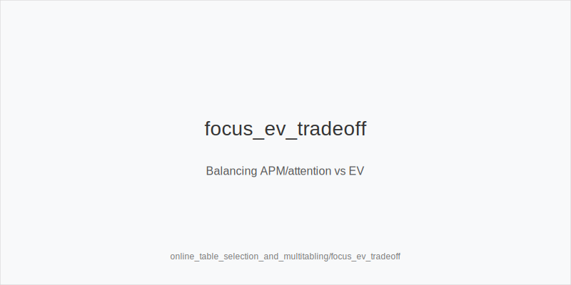

What it is
This module shows how to select soft online games and scale multitabling without breaking your strategy. You will translate selection and load choices into frequency shifts using only: 3bet_ip_9bb, 3bet_oop_12bb, 4bet_ip_21bb, 4bet_oop_24bb, small_cbet_33, half_pot_50, big_bet_75, size_up_wet, size_down_dry, protect_check_range, delay_turn, probe_turns, double_barrel_good, triple_barrel_scare, call, fold, overfold_exploit.

[[IMAGE: online_select_signals | Fast signals of soft tables]]

[[IMAGE: multitabling_layouts | Table layouts: tile/stack + hotkeys]]

[[IMAGE: focus_ev_tradeoff | Balancing APM/attention vs EV]]

Why it matters
Game choice and workload change EV/hour more than thin in-hand edges. Soft pools allow wider 3bet_oop_12bb, more overfold_exploit, and thinner half_pot_50 value. Tough reg pools demand more protect_check_range, delay_turn, disciplined fold vs big_bet_75, and fewer speculative calls. Multitabling adds execution limits, so you simplify to stable size families and blocker-driven decisions.

Rules of thumb

* Selection signals: frequent preflop fast folds, tiny river bets, many short stacks, few 4-bets, off-peak time zones. Translate to wider 3bet_oop_12bb / 3bet_ip_9bb and more overfold_exploit; keep small_cbet_33 and half_pot_50 as defaults.
* Formats: fastfold reduces information and table selection; play more standardized lines, fewer thin calls or triple_barrel_scare spots. Reg tables vs recs allow targeted big_bet_75 on dynamic boards (size_up_wet) when folds spike; otherwise size_down_dry for thin value.
* Multitabling scale: tile to learn, stack with hotkeys later. As tables increase, bias to small_cbet_33, half_pot_50, delay_turn, protect_check_range; use big_bet_75 only with blockers and clear fold equity.
* Exploit shifts: tag overfold_exploit only after repeated evidence (fast folds to 12bb, fold-heavy turns). If the pool defends rivers, pick half_pot_50 for value; if it overfolds scare rivers, consider triple_barrel_scare with blockers.
* Session safety: cap tables, schedule breaks, use stop-loss/win. Under fatigue, reduce triple_barrel_scare and thin calls; increase protect_check_range and delay_turn.

Mini example
HU 100bb during a soft late-night window. Lobby shows many short stacks and fast folds to opens. Preflop: widen 3bet_oop_12bb with A5s and tag overfold_exploit versus SB 2.0bb. 3-bet pot on A82r, pot ~18bb: default small_cbet_33 (size_down_dry). If the turn brings 9c and notes show tank-then-fold to pressure, choose double_barrel_good with half_pot_50; reserve big_bet_75 for dynamic turns or when blockers improve folds. On rivers where the pool under-bluffs big sizes, fold marginal bluff-catchers; against calling stations, thin value with half_pot_50. If you ramp from 6 to 12 tables mid-session, simplify: more small_cbet_33, more delay_turn with medium strength, fewer triple_barrel_scare attempts unless reads are clear.

Common mistakes

* Chasing tough pools. Mistake: you grind regs instead of joining soft waitlists, dropping EV/hour. Why it happens: selection bias and ego.
* Inventing new sizes when overloaded. Mistake: off-tree bets create errors. Why it happens: cognitive load while stacking tables.
* Refusing to fold rivers in reg pools. Mistake: population under-bluffs big sizes. Why it happens: hero-call bias and loss aversion.
* Overextending table count. Mistake: quality collapses and bluff frequency drifts up. Fix: downshift to small_cbet_33 / half_pot_50, add delay_turn and protect_check_range.

Mini-glossary
Soft table: opponents fast-fold, few 4-bets, tiny rivers; widen 3bet_oop_12bb/3bet_ip_9bb and use overfold_exploit.
Fastfold: format with rapid new hands; standardize to small_cbet_33/half_pot_50 and fold more thinly.
Tile/stack: layout choice; more tables → more delay_turn/protect_check_range, fewer big_bet_75 bluffs.
Autopilot: habitual actions; punish with probe_turns and double_barrel_good on good turns.
EV/hour: output measure; selection and load change frequencies more than micro in-hand tweaks.
Stop-loss/win: session guardrails; under fatigue, shift from triple_barrel_scare to protect_check_range and fold more marginally.

Contrast
This module changes frequencies by table choice and workload while preserving the same token set and size families from HU, postflop, and math modules.

See also
- live_etiquette_and_procedures (score 33) → ../../live_etiquette_and_procedures/v1/theory.md
- live_full_ring_adjustments (score 33) → ../../live_full_ring_adjustments/v1/theory.md
- live_speech_timing_basics (score 33) → ../../live_speech_timing_basics/v1/theory.md
- online_hud_and_db_review (score 33) → ../../online_hud_and_db_review/v1/theory.md
- cash_short_handed (score 31) → ../../cash_short_handed/v1/theory.md