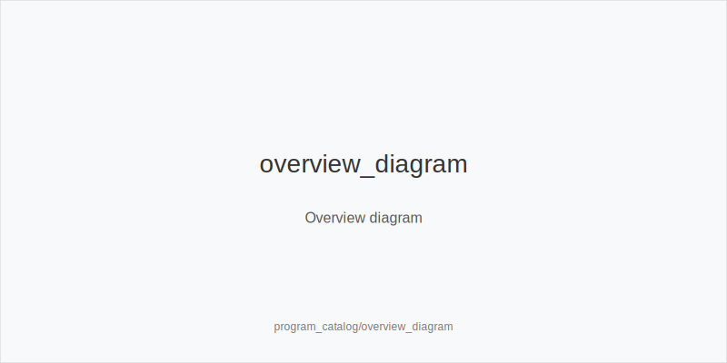

# Program Catalog (v1)
Audience: external readers and newcomers. This catalog lists all 81 training modules with brief notes. Each module's source lives in its own folder and ships with three files: `theory.md`, `demos.jsonl`, and `drills.jsonl`.

**Fixed action system across all modules:** preflop ladders `3bet_ip_9bb`, `3bet_oop_12bb`, `4bet_ip_21bb`, `4bet_oop_24bb`; postflop size families `small_cbet_33`, `half_pot_50`, `big_bet_75`; concepts/tokens `size_up_wet`, `size_down_dry`, `protect_check_range`, `delay_turn`, `probe_turns`, `double_barrel_good`, `triple_barrel_scare`, `call`, `fold`, `overfold_exploit`. Physics-first: static boards -> dry family; dynamic boards -> wet family. Reads/economics only shift **frequencies**, never sizes or trees.

---

## Live overlay (how it works)
The Live overlay toggles a live context over Cash/MTT without duplicating trees. It adds scenario flags (`has_straddle`, `bomb_ante`, `multi_limpers`, `rake_type(time|drop)`, `announce_required`, `avg_stack_bb`, `table_speed`) and procedural validators (`string_bet`, `single_motion_raise_legal`, `bettor_shows_first`, `first_active_left_of_btn_shows`). Modules and SpotKind stay the same; frequency nudges reflect live conditions.

---

## Core
1. **core_rules_and_setup** - Table rules, order of action, showdown basics.
2. **core_positions_and_initiative** - Positions, IP/OOP and initiative transfer.
3. **core_pot_odds_equity** - Pot odds, equity, price-aware decisions.
4. **core_starting_hands** - Baseline starting ranges and blockers.
5. **core_flop_fundamentals** - Flop strategy, range vs polarized c-bets.
6. **core_turn_fundamentals** - Turn planning: barrels, delays, probes.
7. **core_river_fundamentals** - River value/bluff thresholds and discipline.
8. **core_board_textures** - Static vs dynamic boards and family selection.
9. **core_equity_realization** - How position/line/SPR convert equity to EV.
10. **core_bet_sizing_fe** - 33/50/75 families and fold equity mechanics.
11. **core_check_raise_systems** - Check-raise triggers, blockers, and caps.
12. **core_gto_vs_exploit** - Baseline balance vs evidence-based exploits.
13. **core_bankroll_management** - Bankroll, risk, limits, shot-taking.
14. **core_mental_game** - Focus routines, tilt guards, session hygiene.
15. **core_note_taking** - Notes, tags, structure aligned to tokens.

## Cash
16. **cash_rake_and_stakes** - Rake/limits, table selection, stake economics.
17. **cash_single_raised_pots** - SRP: preflop-to-river plans with families.
18. **cash_threebet_pots** - 3-bet pots: lower SPR playbooks.
19. **cash_fourbet_pots** - 4-bet pots: reverse SPR and commitment.
20. **cash_multiway_pots** - Multiway heuristics; merged value focus.
21. **cash_multiway_3bet_pots** - Multiway 3-bet adjustments.
22. **cash_blind_defense** - BB/SB defense vs positions and sizes.
23. **cash_blind_vs_blind** - SB vs BB structures and exploits.
24. **cash_isolation_raises** - Isolating limpers; postflop plans.
25. **cash_squeeze_strategy** - Squeezes: ranges, blockers, outcomes.
26. **cash_short_handed** - 6-max dynamics and frequency shifts.
27. **cash_population_exploits** - Common pool leaks -> tokenized actions.
28. **cash_limp_pots_systems** - Limped pots: probe_turns, probes, merged lines.
29. **cash_delayed_cbet_and_probe_systems** - Delayed c-bets & probe trees.
30. **cash_overbets_and_blocker_bets** - Overbets/blocker bets within families.

## MTT
31. **mtt_antes_phases** - Antes phases, opening/defense adjustments.
32. **mtt_short_stack** - Short-stack push/fold and postflop at low SPR.
33. **mtt_mid_stack** - Mid-stack pressure and ICM awareness.
34. **mtt_deep_stack** - Deep-stack leverage and protection.
35. **mtt_icm_basics** - ICM fundamentals and bubble awareness.
36. **mtt_icm_endgame_advanced** - Endgame ICM: ladders and risk control.
37. **mtt_pko_strategy** - PKO basics: bounty EV and ranges.
38. **mtt_pko_advanced_bounty_routing** - Advanced bounty routing logic.
39. **mtt_satellite_strategy** - Satellites: survive-first, value thresholds.
40. **mtt_day2_bagging_and_reentry_ev** - Bagging, re-entry, and EV tradeoffs.
41. **mtt_final_table_playbooks** - Final table plans by stack/seat/ICM.
42. **mtt_late_reg_strategy** - Late registration EV and range shifts.
43. **icm_bubble_blind_vs_blind** - Bubble BvB specifics with ICM pressure.

## Heads-Up
44. **hu_preflop** - HU preflop practice and blockers.
45. **hu_postflop** - HU postflop practice by texture family.
46. **hu_turn_play** - HU turn decision-making and commitment.
47. **hu_river_play** - HU river: blockers, thresholds, sizes.
48. **hu_preflop_strategy** - HU preflop ranges and deviations.
49. **hu_postflop_play** - HU postflop strategy map.
50. **hu_exploit_adv** - Advanced HU exploits by repetition tiers.

## Math
51. **math_intro_basics** - Poker-math foundations.
52. **math_pot_odds_equity** - Pot odds & equity calculations.
53. **math_combo_blockers** - Combinatorics, removal/blockers.
54. **math_ev_calculations** - EV math and sensitivity checks.
55. **math_icm_basics** - ICM math fundamentals.
56. **math_icm_advanced** - Advanced ICM models.
57. **math_solver_basics** - Solver setup and compact trees.
58. **solver_node_locking_basics** - Node locking workflow.

## Cross / Online dynamics
59. **online_tells_and_dynamics** - Online cadence and patterns.
60. **online_table_selection_and_multitabling** - Selection and multitabling.
61. **online_fastfold_pool_dynamics** - Fastfold pool quirks.
62. **online_economics_rakeback_promos** - Site incentives & rakeback.
63. **hudless_strategy_and_note_coding** - HUD-less tags -> tokens.
64. **exploit_advanced** - Advanced multi-node exploits.
65. **donk_bets_and_leads** - probe_turns bets & turn probe_turns systematized.
66. **spr_basics** - SPR basics: geometry of stacks vs pot.
67. **spr_advanced** - Advanced SPR planning and commitment.
68. **hand_review_and_annotation_standards** - Review/annotation grammar.
69. **review_workflow_and_study_routines** - Weekly workflow & KPIs.
70. **database_leakfinder_playbook** - DB/HUD leakfinding -> actions.

## Live overlay (applied over Cash/MTT)
71. **live_tells_and_dynamics** - Physical/timing reads & reliability.
72. **live_etiquette_and_procedures** - Etiquette, procedures, and safeguards.
73. **live_full_ring_adjustments** - Full-ring frequency shifts.
74. **live_special_formats_straddle_bomb_ante** - Straddles & bomb antes.
75. **live_table_selection_and_seat_change** - Table/seat moves for EV/h.
76. **live_chip_handling_and_bet_declares** - Chip handling & declarations.
77. **live_speech_timing_basics** - Speech/timing cues -> tokens.
78. **live_rake_structures_and_tips** - Rake/time/tips -> frequency shifts.
79. **live_floor_calls_and_dispute_resolution** - Floor calls & disputes.
80. **live_session_log_and_review** - Live session logging & review loop.
81. **live_security_and_game_integrity** - Security & game integrity basics.

---

### Source structure
Each module resides in `content/<module_name>/v1/` with:
- `theory.md` - narrative and rules of thumb
- `demos.jsonl` - demo step flows (SpotKind-tagged)
- `drills.jsonl` - single-token drills

See also

What it is
[[IMAGE: overview_diagram | Overview diagram]]

Why it matters

Rules of thumb

Mini example

Common mistakes

Mini-glossary

Contrast