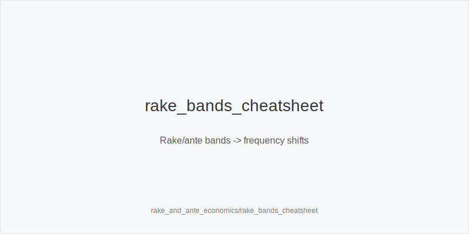
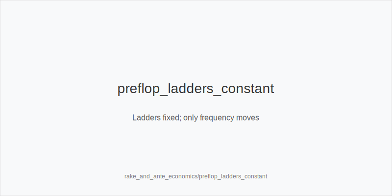
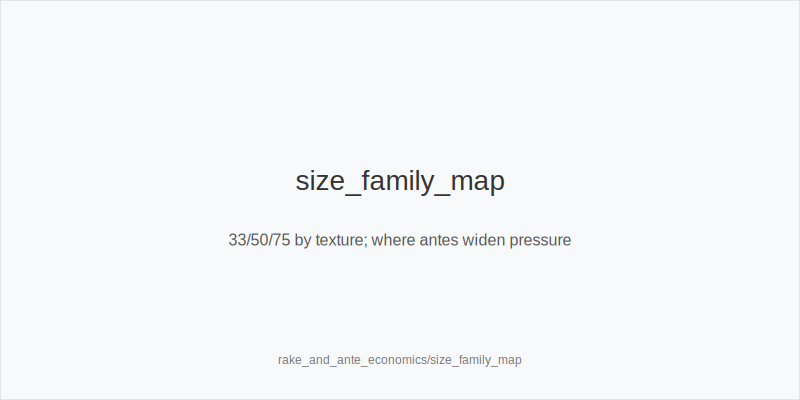

What it is
This module explains how rake and antes shift incentives and how to convert those shifts into **frequency** changes using the same ladders and size families. We never change sizes. We only adjust how often we use: 3bet_ip_9bb, 3bet_oop_12bb, 4bet_ip_21bb, 4bet_oop_24bb, small_cbet_33, half_pot_50, big_bet_75, size_up_wet, size_down_dry, protect_check_range, delay_turn, probe_turns, double_barrel_good, triple_barrel_scare, call, fold, overfold_exploit. Texture still rules: size_down_dry on static boards, size_up_wet on dynamic boards.

[[IMAGE: rake_bands_cheatsheet | Rake/ante bands -> frequency shifts]]

[[IMAGE: preflop_ladders_constant | Ladders fixed; only frequency moves]]

[[IMAGE: size_family_map | 33/50/75 by texture; where antes widen pressure]]

Why it matters
Rake taxes small pots and weak realization, especially OOP. That favors tighter flats OOP and more value‑heavy 3‑bets. Antes add dead money, rewarding steals and pressure. These economics change EV/hour more than micro in‑hand tweaks. You keep the same ladders and 33/50/75 sizes, but you shift frequencies-especially preflop and on turn/river pressure nodes.

Rules of thumb

* **Rake‑heavy (cash, no ante):** slightly reduce OOP flats; prefer **3bet_oop_12bb** for value over marginal call. Postflop on static flops, use **small_cbet_33** with **size_down_dry**; trim thin OOP calls. *Why:* rake punishes low‑realization lines.
* **Rake‑light/rake‑free (HU SNG, app games, FT):** widen opens and defends; add **overfold_exploit** if folds rise; ladders unchanged. *Why:* less tax makes steals and calls more profitable.
* **Ante present (MTT/FT):** dead money -> widen **3bet_ip_9bb** and **3bet_oop_12bb** with blockers; postflop favor **half_pot_50** to tax wide ranges; still **size_up_wet** and consider **big_bet_75** on dynamic boards. *Why:* antes boost pot‑to‑stack leverage.
* **Rake bands (quick compass):** if effective rake feels ≳ **6-8 bb/100**, avoid thin OOP flats and light river bluff‑catches; if low, defend a bit wider IP and keep standard calls. *Why:* realization tax scales with rake.
* **SPR mapping unchanged:** **3bet_ip_9bb / 3bet_oop_12bb / 4bet_ip_21bb / 4bet_oop_24bb** stay fixed; shift **frequency** only. *Why:* consistency reduces errors.
* **Rivers in rakey pools:** rake is already paid, but populations tend to under‑bluff big. **Fold** more vs **big_bet_75** without blockers. *Why:* pool effect dominates.
* **Antes vs stations:** with antes, merged calling increases. Choose **half_pot_50** more for value; keep **size_down_dry** for thin value on static. *Why:* tax the width.
* **Probing after check‑check:** ante fields surrender more turns. Use **probe_turns** more when sequence favors it. *Why:* dead money plus passivity.
* **Delay under rake:** when turn raises spike OOP in rakey cash, use **delay_turn** with medium strength to realize. *Why:* avoid paying extra rake via spew lines.

Mini example
Same HU BTN vs BB, 100bb. Flop A83r.

* **Rake‑heavy cash:** BTN opens 2.0bb; BB defends tighter OOP. BTN uses **small_cbet_33** (**size_down_dry**). Versus a turn brick, prefer **half_pot_50** with strong value and **delay_turn** more with medium. Preflop, BTN expects fewer light 4‑bets, so value 3‑bets and **4bet_ip_21bb** with premiums perform well. River facing **big_bet_75** from a tight pool without blockers -> **fold**.
* **Ante MTT:** BTN open gets defended wider. BTN still **small_cbet_33** on A83r, but on many turns prefers **half_pot_50** to tax the width. Preflop, widen **3bet_ip_9bb** and **3bet_oop_12bb** with blockers; tag **overfold_exploit** if blinds fold too much.

Common mistakes

* Copying rake‑free ranges to rakey cash. **Fix:** tighten OOP flats; add **3bet_oop_12bb** value.
* Inventing off‑tree sizes to "beat the rake." **Fix:** keep **33/50/75**; move frequencies.
* Over‑calling OOP because the price "looks close." **Fix:** consider realization tax; **fold** or **3bet_oop_12bb**.
* Over‑pressuring dry boards with **big_bet_75** in rakey pools. **Fix:** **size_down_dry** or **half_pot_50** unless blockers and fold equity are clear.
* Ignoring ante leverage. **Fix:** add **3bet_ip_9bb / 3bet_oop_12bb** with blockers and use **half_pot_50** to tax wide ranges.

Mini-glossary
**Rake:** fee taken from the pot; increases the cost of low‑realization lines. 
**Ante:** forced contribution preflop; adds dead money and widens ranges. 
**Realization tax:** equity lost due to position/rake; higher OOP and in rakey games. 
**Dead money:** chips in the pot not backed by strong ranges; increases steal EV. 
**SPR:** stack‑to‑pot ratio; ladders fix SPR; economics shift frequency, not size.

Contrast
Math and ICM cover prices and payout pressure. Here we layer rake/ante economics on top: physics and sizes stay the same; only frequencies move through the same tokens.

See also
- exploit_advanced (score 31) -> ../../exploit_advanced/v1/theory.md