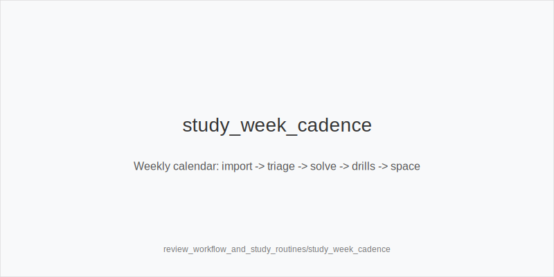
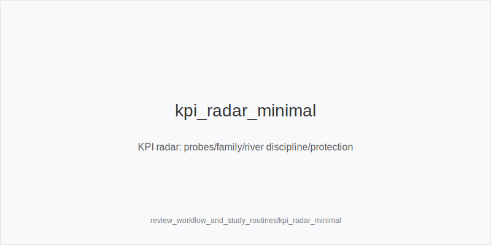
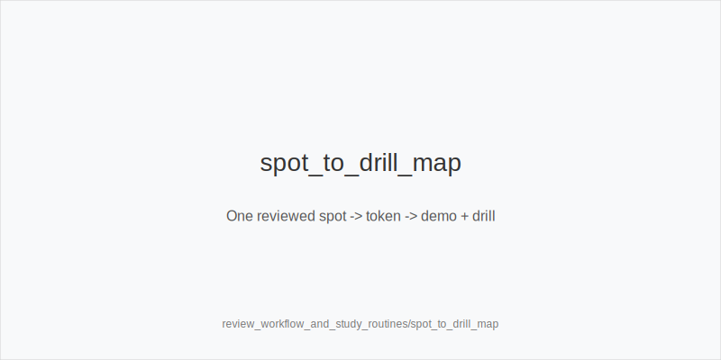

What it is
This module standardizes daily and weekly study routines. The pipeline: capture hands during play, triage them, run a compact solver baseline, optionally sweep a single node lock, map outputs to one action token, create a drill, schedule spaced review, and set next‑session focuses. Trees and sizes stay fixed: preflop ladders 3bet_ip_9bb / 3bet_oop_12bb / 4bet_ip_21bb / 4bet_oop_24bb; postflop families small_cbet_33, half_pot_50, big_bet_75 via size_down_dry or size_up_wet. Outcomes always resolve to one token, including protect_check_range, delay_turn, probe_turns, double_barrel_good, triple_barrel_scare, call, fold, overfold_exploit.

Why it matters
Process beats ad‑hoc browsing. A repeatable loop reduces error rate, converts played hands into drills, and keeps decisions stable under load. You learn faster by reviewing the right spots, locking one knob only when EV persists, and practicing tokens you will actually click at speed.

Rules of thumb

* Hand capture filters: tag HU SRP and 3‑bet pots, dynamic turns, polar rivers, and obvious price errors. Why: these drive most EV swings.
* Triage order: price first, family second (size_down_dry vs size_up_wet), then probe opportunities, then blocker gates on turn/river. Why: fixes compounding leaks.
* Tree discipline: ladders 9/12/21/24 and 33/50/75 only. Why: consistency and transfer.
* Baseline first: read EV and frequencies; small‑EV mixes are acceptable. Why: avoid chasing noise.
* Single‑variable lock: sweep one knob (e.g., Fold vs Turn 75%). Adopt only if EV gains persist and texture agrees, then tag overfold_exploit. Why: guard against overfitting.
* Annotation grammar: one line per street, end with exactly one token. Include texture, family, position, initiative, blockers, sequence, pressure gate (Fv50/Fv75), SPR band. Why: fast recall and drillability.
* Spaced review cadence: fresh → 1d → 3d → 7d. Replace card text with texture and blocker tags only. Why: compress memory to cues you use in play.
* KPI set: missed probe_turns after check‑check, wrong family (size_up_wet / size_down_dry), undisciplined river calls vs big_bet_75 without blockers, skipped protect_check_range, overuse of big_bet_75 on dry boards. Why: dashboards steer focus.
* Session prep: warmup checklist and three priorities. Close loop with a cooldown snapshot and next‑session plan. Why: maintain alignment with the KPIs.
* Drill pipeline: each reviewed hand becomes one demo and one drill with a single‑token answer. Why: frictionless practice.

[[IMAGE: study_week_cadence | Weekly calendar: import -> triage -> solve -> drills -> space]]

[[IMAGE: kpi_radar_minimal | KPI radar: probes/family/river discipline/protection]]

[[IMAGE: spot_to_drill_map | One reviewed spot -> token -> demo + drill]]

Mini example
Hand 1 (SRP): IP on K72r. Annotation: Texture=dry, Family=33, PFA=IP, SPR=high, Raise risk=normal. Token: size_down_dry + small_cbet_33. Spacing: 1d.
Hand 2 (missed probe): Flop checks through on Q84r. Annotation: Sequence=chk‑chk, SPR=high, Turn favorable. Token: probe_turns. KPI: +1 missed probe.
Hand 3 (3‑bet pot): JT9ss, turn 8x. Baseline chooses half_pot_50; lock sweep shows Fv75 up. With blockers, Token: double_barrel_good using big_bet_75. Gate overfold_exploit only if trend persists.
River discipline: A94r‑6s‑Kd facing big_bet_75 without blockers. Token: fold. Add to spacing: 3d.

Common mistakes
Overbuilt trees that do not match play. Multi‑lock spaghetti that chases noise. Frequencies without EV context. Off‑tree sizes. Drills that do not end in a single token. Skipping blockers when deciding river call or triple_barrel_scare.

Mini-glossary
Baseline: initial solver run with compact trees and fixed families.
Lock sweep: testing one variable (e.g., Fv75) across plausible ranges.
Spacing tier: scheduled review intervals (fresh/1d/3d/7d).
KPI: a minimal metric you track weekly (e.g., missed probe_turns).
Token set: the fixed actions you execute in play.

Contrast
study_review_handlab is the lab recipe for one spot. This module is the weekly calendar: capture, triage, baseline, one lock, token mapping, drills, spacing, and KPI dashboards. Sizes and ladders remain identical; routines only shift frequencies.

See also
- icm_final_table_hu (score 31) → ../../icm_final_table_hu/v1/theory.md
- live_session_log_and_review (score 31) → ../../live_session_log_and_review/v1/theory.md
- live_table_selection_and_seat_change (score 31) → ../../live_table_selection_and_seat_change/v1/theory.md
- online_economics_rakeback_promos (score 31) → ../../online_economics_rakeback_promos/v1/theory.md
- online_hudless_strategy_and_note_coding (score 31) → ../../online_hudless_strategy_and_note_coding/v1/theory.md