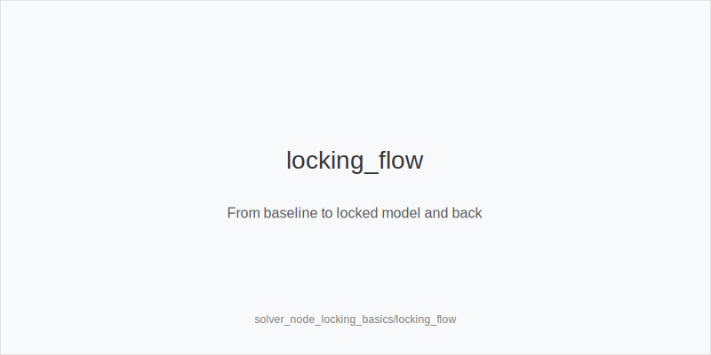
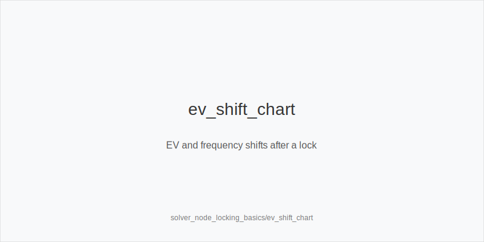
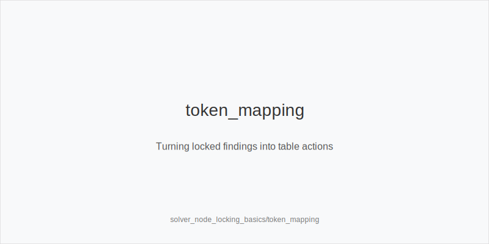

What it is
Node locking is a solver workflow where you fix parts of an opponent strategy at a node (e.g., fold%, raise rate, bet size mix) and let the solver re-optimize your side. You compare the locked solution to the baseline tree and translate the EV and frequency shifts into in-game actions: 3bet_ip_9bb, 3bet_oop_12bb, 4bet_ip_21bb, 4bet_oop_24bb, small_cbet_33, half_pot_50, big_bet_75, size_up_wet, size_down_dry, protect_check_range, delay_turn, probe_turns, double_barrel_good, triple_barrel_scare, call, fold, overfold_exploit.

[[IMAGE: locking_flow | From baseline to locked model and back]]

[[IMAGE: ev_shift_chart | EV and frequency shifts after a lock]]

[[IMAGE: token_mapping | Turning locked findings into table actions]]

Why it matters
Pools rarely match baseline equilibria. If the BB overfolds to turn big_bet_75 or under-bluffs polar rivers, your best line changes. Locking converts reads into precise counter-strategies without guessing sizes. The result is a plan that is solver-aligned by construction and exploit-aware in execution, portable from HU to 6-max and MTT spots.

Rules of thumb
- Build compact baselines: preflop ladders 3bet_ip_9bb / 3bet_oop_12bb / 4bet_ip_21bb / 4bet_oop_24bb; postflop sizes small_cbet_33 / half_pot_50 / big_bet_75; why: stable trees make deltas legible.
- Lock one thing at a time: e.g., raise% on flop, fold% to turn big_bet_75, or river bluff rate; why: single-variable locks isolate causes.
- Read outputs, not just colors: prefer the highest-EV action even if its frequency is modest; why: EV, not frequency, pays.
- Map textures to sizes: size_down_dry on A83r, K72r; size_up_wet on JT9ss, 986ss; why: the lock modifies pressure, not physics.
- Convert patterns to tokens: more folds to turn big_bet_75 implies size_up_wet + big_bet_75; under-bluffed rivers imply fold; capped checks imply probe_turns; over-stabs imply protect_check_range or delay_turn.
- Guard against noise: require persistent EV gain across reasonable lock ranges before tagging overfold_exploit.

Mini example
HU 100bb SRP. Baseline tree: SB opens, BB calls. Flop K72r. Baseline prefers small_cbet_33 (size_down_dry) high frequency IP, mixing protect_check_range with some Kx. Lock: set BB turn fold versus big_bet_75 higher than baseline on brick turns. Re-solve. Output: on K72r-3h the EV of double_barrel_good increases and the preferred size shifts toward big_bet_75 on turn (size_up_wet not needed because board is dry; the lock itself raises fold%). River lock: set BB under-bluffs big bets. Output shifts toward fold with weak Kx versus big_bet_75 and call when holding better blockers. Translate: small_cbet_33 on flop, double_barrel_good on safe turns more often, and disciplined river folds without key blockers.

Common mistakes
- Confirmation bias: locking extreme folds then celebrating huge EV. Fix: sweep realistic ranges and seek robust gains before tagging overfold_exploit.
- Overfitting the tree: inventing new sizes to chase tiny EV. Fix: keep small_cbet_33 / half_pot_50 / big_bet_75 and the preflop ladders; let frequency do the work.
- Multi-lock spaghetti: changing three variables at once. Fix: iterate locks one node at a time and record deltas.
- Ignoring position: assuming OOP realizes equity like IP. Fix: prefer delay_turn OOP with medium strength and use probe_turns only when the turn truly favors you.

Mini-glossary
Node locking: constraining opponent actions at a decision point so the solver optimizes against that fixed strategy.
Baseline: the unlocked equilibrium tree that provides reference EV and frequencies.
Lock sweep: testing several plausible lock values to avoid overfitting to one guess.
Exploit tag: a table note to apply overfold_exploit, big_bet_75, or fold more often when the lock shows robust EV.

Contrast
Solver_basics teaches how to read baseline outputs; this module shows how to lock realistic opponent tendencies and convert stable EV shifts into the same tokenized actions for real play.

See also
- database_leakfinder_playbook (score 27) -> ../../database_leakfinder_playbook/v1/theory.md
- exploit_advanced (score 27) -> ../../exploit_advanced/v1/theory.md
- hand_review_and_annotation_standards (score 27) -> ../../hand_review_and_annotation_standards/v1/theory.md
- icm_final_table_hu (score 27) -> ../../icm_final_table_hu/v1/theory.md
- live_etiquette_and_procedures (score 27) -> ../../live_etiquette_and_procedures/v1/theory.md