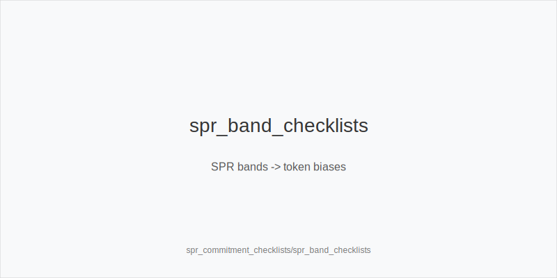

What it is
A practical system to decide whether a turn bet commits you to the river using SPR bands and the fixed 33/50/75 families. Works for SRP and 3-bet pots, IP and OOP. Family by texture, then size, then a single decision token. No new sizes or trees.

Why it matters
Bad turn barrels force miserable rivers. Checklists keep you inside 33/50/75, align leverage with texture, blockers, and evidence (Fv50/Fv75), and avoid spew at mid SPR, especially OOP. You press only when blockers and data support it, and you plan the river while still on the turn.

Rules of thumb
- Family first. Static (A83r, K72r) -> size_down_dry -> small_cbet_33; dynamic (JT9ss, 986ss) -> size_up_wet -> half_pot_50. Why: physics-first selection lowers raise risk and error rate.
- SPR bands (after flop, before turn). High (>=3): prefer half_pot_50 or delay_turn unless nuts + blockers. Mid (1.5-3): main decision band; apply upgrade and commitment gates before big_bet_75. Low (<=1.5): commitment is easy, but still require blockers before polarizing. Why: leverage and risk change nonlinearly with SPR.
- 50->75 upgrade gates (all required). 1) Blockers to top value/strong draws; 2) Evidence: Turn Fv75 up (logged/read); 3) Commitment gate: a 75% turn must not force bad rivers with weak equity. If any gate fails -> stay half_pot_50 or delay_turn. Why: bigger needs proof and a clean river plan.
- Raise-risk control. Versus raise-prone villains at mid SPR choose delay_turn; on stabby textures add protect_check_range earlier. Why: avoid raise wars and preserve equity realization OOP.
- Sequence and river discipline. Flop chk-chk -> probe_turns only on favorable turns; never probe after bet/call. Versus polar big_bet_75 without blockers -> fold; with scare + strong blockers and a plan -> triple_barrel_scare (as PFA) or call. Why: initiative is earned by the skip, and blockers filter real bluffs.

Mini example
1) SB vs BTN 3BP IP: CO folds, BTN opens, SB 3-bets, BB folds, BTN calls. Flop T98ss -> size_up_wet; default half_pot_50. Turn Qs with nut spade blocker and logged Fv75 up -> big_bet_75 for double_barrel_good. 
2) BB OOP SRP vs CO: CO opens, BTN folds, SB folds, BB defends. Flop K72r -> size_down_dry; mid SPR vs raise-prone IP -> delay_turn. River polar 75 without blockers -> fold. 
3) UTG vs MP SRP: UTG opens, MP calls, CO folds, BTN folds, SB folds, BB folds. Flop Q84r checks through -> Sequence: chk-chk; safe 6d turn -> probe_turns; later turns without blockers -> stay half_pot_50.

Common mistakes
- Upgrading to big_bet_75 without blockers or evidence. 
- Probing without chk-chk. 
- Calling polar 75% rivers without blockers. 
- Mixing families (wet label with dry default). 
- Commitment blindness: forcing trivial river jams with weak equity.

Mini-glossary
SPR band: High >=3 / Mid 1.5-3 / Low <=1.5; biases token choices, not sizes. 
Commitment gate: Before using 75% on turn, ensure it does not force bad rivers without equity/blockers. 
Fv50/Fv75: Observed fold vs 50%/75% used to justify upgrades and calls.

Contrast
Connects cash and ICM barreling modules but adds explicit SPR checklists. Tokens and sizes remain the same: size_down_dry vs size_up_wet, and small_cbet_33 / half_pot_50 / big_bet_75.

[[IMAGE: spr_band_checklists | SPR bands -> token biases]]

[[IMAGE: turn_upgrade_gates_spr | 50 -> 75% gates + commitment check]]

[[IMAGE: river_plan_flow | Turn choice -> river plan discipline]]

See also
- cash_3bet_oop_playbook (score 25) → ../../cash_3bet_oop_playbook/v1/theory.md
- cash_blind_defense_vs_btn_co (score 25) → ../../cash_blind_defense_vs_btn_co/v1/theory.md
- cash_population_exploits (score 25) → ../../cash_population_exploits/v1/theory.md
- cash_turn_river_barreling (score 25) → ../../cash_turn_river_barreling/v1/theory.md
- donk_bets_and_leads (score 25) → ../../donk_bets_and_leads/v1/theory.md